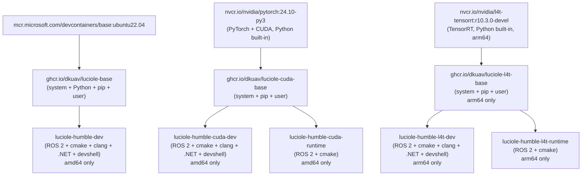
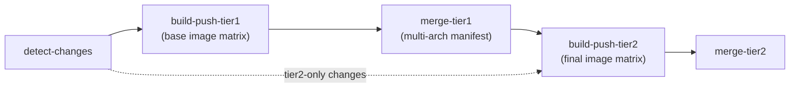

# DKUAV Images

Docker image management repository for the DKUAV project. Images are automatically built and published to GitHub Container Registry (`ghcr.io/dkuav/<image>`) via GitHub Actions.

> 中文文档请见 [README_zh.md](README_zh.md)

## Image Architecture

The repository uses a **two-tier image hierarchy** to maximise layer reuse across 3 OS families (Ubuntu, CUDA/PyTorch, L4T):



### Tier 1 — Base Images

Published to GHCR; used as `FROM` in Tier 2 Dockerfiles.

| Image | Base FROM | Arch | Description |
|-------|-----------|------|-------------|
| [`luciole-base`](src/luciole-base/) | `mcr.microsoft.com/devcontainers/base:ubuntu22.04` | amd64 + arm64 | Ubuntu 22.04 + Python 3.10 + pip packages + user |
| [`luciole-cuda-base`](src/luciole-cuda-base/) | `nvcr.io/nvidia/pytorch:24.10-py3` | amd64 + arm64 | PyTorch/CUDA + pip packages + user |
| [`luciole-l4t-base`](src/luciole-l4t-base/) | `nvcr.io/nvidia/l4t-tensorrt:r10.3.0-devel` | arm64 only | L4T TensorRT + pip packages + user |

### Tier 2 — Final Images

| Image | Base | Arch | Includes |
|-------|------|------|---------|
| [`luciole-humble-dev`](src/luciole-humble-dev/README.md) | `luciole-base` | amd64 only | ROS 2 Humble · cmake · clang · .NET · devshell |
| [`luciole-humble-cuda-dev`](src/luciole-humble-cuda-dev/) | `luciole-cuda-base` | amd64 only | ROS 2 Humble · cmake · clang · .NET · devshell |
| [`luciole-humble-cuda-runtime`](src/luciole-humble-cuda-runtime/) | `luciole-cuda-base` | amd64 only | ROS 2 Humble · cmake |
| [`luciole-humble-l4t-dev`](src/luciole-humble-l4t-dev/) | `luciole-l4t-base` | arm64 only | ROS 2 Humble · cmake · clang · .NET · devshell |
| [`luciole-humble-l4t-runtime`](src/luciole-humble-l4t-runtime/) | `luciole-l4t-base` | arm64 only | ROS 2 Humble · cmake |

**devshell** includes: zsh · oh-my-zsh · neovim (NvChad) · starship · nvm · bat · fzf · eza · zoxide

## Pull an Image

```bash
docker pull ghcr.io/dkuav/<image-name>:latest
```

## Local Build

All Dockerfiles use the **repository root** as build context. Run from the **image directory**:

```bash
cd src/<image-name>
docker compose build
```

Or directly from the repo root:

```bash
docker build -f src/<image-name>/Dockerfile -t <image-name> .
```

## Adding a New Image

1. Decide tier: Tier 1 (new base) or Tier 2 (builds on an existing base).
2. Create `src/<image-name>/` with `Dockerfile` (required), `docker-compose.yml`, `README.md`, and `README_zh.md`.
3. Update [`src/image-deps.json`](src/image-deps.json) — add to `base_images` or `dependencies`, and add to `arch_overrides` if the image is arch-restricted.
4. Push to `main` — CI detects changes and builds automatically.

See [AGENTS.md](AGENTS.md) for full CI/CD behavior, naming conventions, and shared-script details.

## CI/CD



- **Change detection** (reads `src/image-deps.json`):
  - `src/_scripts/**` changed → rebuild **all** images
  - Base image changed → rebuild that base **+** all dependent final images
  - Final image changed → rebuild that final only
  - `workflow_dispatch` → build everything
- **Multi-arch**: amd64 (`ubuntu-24.04`) and arm64 (`ubuntu-24.04-arm`, native — no QEMU) are built separately, pushed by digest, and merged into a single multi-arch manifest. `arch_overrides` in `image-deps.json` limits arch-specific images.
- **Tags**: `latest`, `main`, `sha-<git-sha>`.
- **Auth**: `GITHUB_TOKEN` only — no extra secrets needed.

Workflow: [`.github/workflows/publish-images.yml`](.github/workflows/publish-images.yml)

