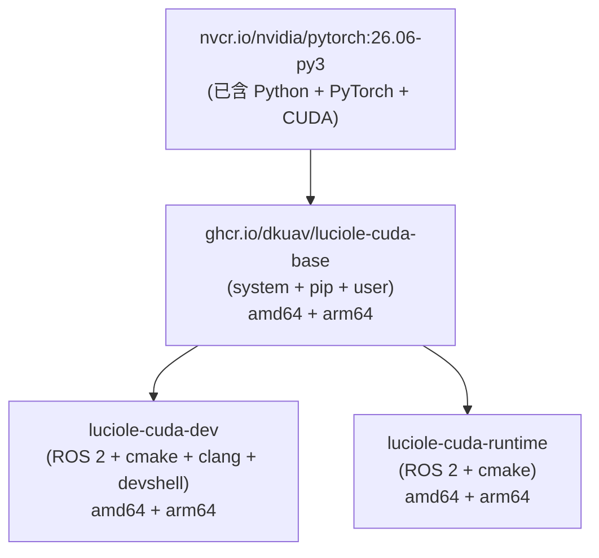
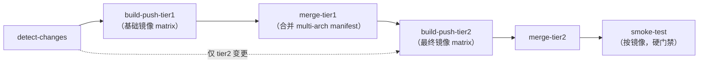

# DKUAV Images

DKUAV 项目的 Docker 镜像管理仓库。镜像通过 GitHub Actions 自动构建并发布至 GitHub Container Registry（`ghcr.io/dkuav/<image>`）。

> For English documentation, see [README.md](README.md)

## 镜像架构

本仓库采用**两级镜像层级**，统一在 amd64（x86_64 工作站）与 arm64（NVIDIA Jetson）之间最大化复用镜像层：



### 第一层 — 基础镜像

发布至 GHCR，供第二层 Dockerfile 作为 `FROM` 使用。

| 镜像 | 基础 FROM | 架构 | 描述 |
|------|-----------|------|------|
| [`luciole-cuda-base`](src/luciole-cuda-base/) | `nvcr.io/nvidia/pytorch:26.06-py3` | amd64 + arm64 | PyTorch/CUDA + pip 包 + 用户 |

### 第二层 — 最终镜像

| 镜像 | 基础 | 架构 | 包含内容 |
|------|------|------|---------|
| [`luciole-cuda-dev`](src/luciole-cuda-dev/README_zh.md) | `luciole-cuda-base` | amd64 + arm64 | ROS 2 Humble · cmake（继承自 base）· clang · devshell |
| [`luciole-cuda-runtime`](src/luciole-cuda-runtime/) | `luciole-cuda-base` | amd64 + arm64 | ROS 2 Humble · cmake（继承自 base） |

**devshell** 包含：zsh · oh-my-zsh · neovim（NvChad）· starship · nvm · bat · fzf · eza · zoxide · pre-commit（预缓存 hooks）

## 使用镜像

```bash
docker pull ghcr.io/dkuav/<image-name>:latest
```

## 本地构建

所有 Dockerfile 均以**仓库根目录**为 build context。在**镜像目录**下运行：

```bash
cd src/<image-name>
docker compose build
```

或从仓库根目录直接构建：

```bash
docker build -f src/<image-name>/Dockerfile -t <image-name> .
```

## 添加新镜像

1. 确定层级：第一层（新基础镜像）或第二层（依赖已有基础镜像）。
2. 在 `src/<image-name>/` 下创建 `Dockerfile`（必须）、`docker-compose.yml`、`README.md` 和 `README_zh.md`。
3. 更新 [`src/image-deps.json`](src/image-deps.json) — 加入 `base_images` 或 `dependencies`，如有架构限制则加入 `arch_overrides`。
4. Push 到 `main`，CI 自动检测变更并构建发布。

详见 [AGENTS.md](AGENTS.md) 了解完整的 CI/CD 行为、命名约定和共享脚本说明。

## CI/CD



- **变更检测**（读取 `src/image-deps.json`）：
  - `src/_scripts/**` 或 `src/_assets/**` 有变更 → 重建**全部**镜像
  - 基础镜像有变更 → 重建该基础镜像**及**所有依赖它的最终镜像
  - 最终镜像有变更 → 只重建该最终镜像
  - `workflow_dispatch` → 构建全部镜像
- **多架构**：amd64（`ubuntu-24.04`）和 arm64（`ubuntu-24.04-arm` 原生 Runner，无 QEMU）分别构建，按 digest 推送后合并为 multi-arch manifest。`image-deps.json` 中的 `arch_overrides` 可限制镜像仅在特定架构构建。
- **Smoke 测试（硬门禁）**：本次实际构建的每个镜像都会以其 `sha-<git-sha>` 标签被拉下，在原生架构 runner 上跑 [`src/_tests/smoke-<image>.sh`](src/_tests/)。任一断言失败（如 OpenCV `find_package` 泄露、工具缺失、ROS target 错误）**会判定整个流水线失败**。
- **标签**：`latest`、`main`、`sha-<git-sha>`。
- **认证**：仅需 `GITHUB_TOKEN`，无需额外 secrets。

工作流定义：[`.github/workflows/publish-images.yml`](.github/workflows/publish-images.yml)
